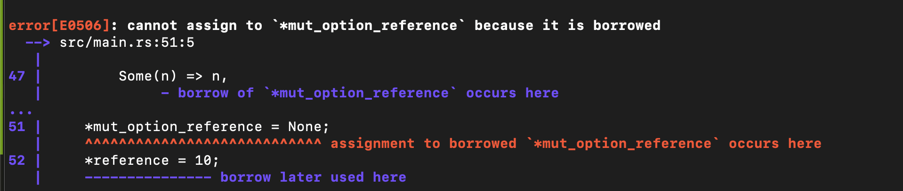
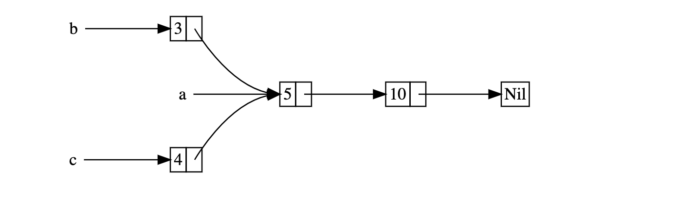
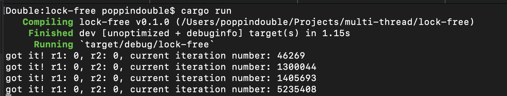
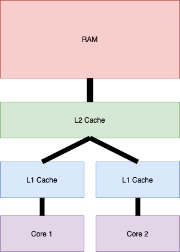
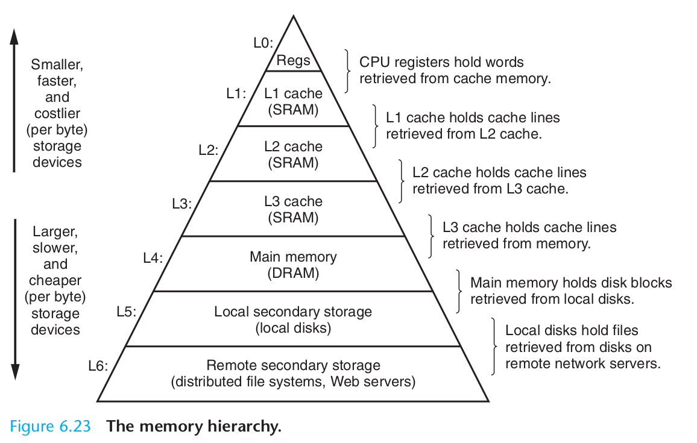
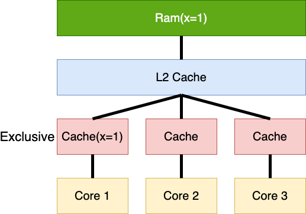
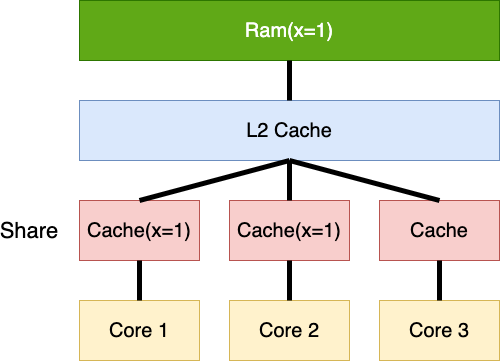
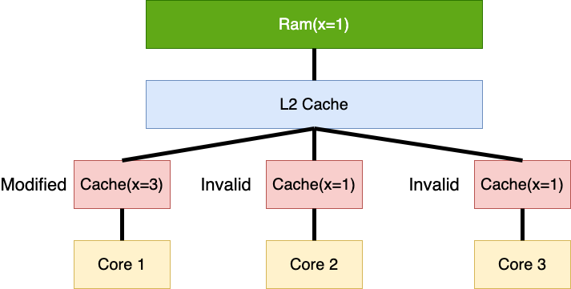
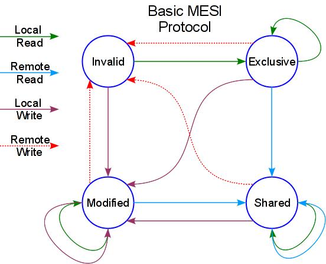

# Explore Rust Lock Free Programming

This series blog is a learning path of lock-free programing in Rust. We will start with something really simple, then I will introduce some smart pointers of Rust. Understanding the design of these smart pointers will help us to understand some design pattern of Rust(for example, the relation between `Refcell` and `RWLock`, `MutRef` and `MutexGuard`, etc), and we start to optimize our simple project, eventually we will reach the point of lock-free programming(currently I don't have a flame graph or benchmark to give out a concrete number about performance, because this blog mainly focuses on learning experience). As we go along the path, some other contents besides lock-free programming will also be introduced. Hopefully, at the end of this series blog, you can see some common design patterns in Rust, have a better understanding of Rust's safety feature. If I made any mistakes in the following contents, please let me know. My Email: poppindouble@gmail.com

## Contents
1. [Let's start with something simple](#lets-start-with-something-simple)
2. [Before we step our toes into optimization](#before-we-optimize-our-code)
3. [First attempt for optimization](#first-attempt-for-optimization)
4. [Second attempt for optimization](#second-attempt-for-optimization)
5. [From a CPU Perspective](#from-a-cpu-perspective)
6. [Atomic](#atomic)
7. [Memory barrier](#memory-barrier)
8. [What is a lock?](#what-is-a-lock)
9. [Third attempt for optimization](#third-attempt-for-optimization)
10. [Memory management](#memory-management)

## The Creed

**1. any borrow must last for a scope no greater than that of the owner.**

**2. You can either have one or more immutable references to a specific memory location or you can have only one mutable reference to that memory location**

As we go through this blog, always think about Rust's creed, this creed will be manifested everywhere in the Rust's code.

## Let's start with something simple

### Description
Assume we need to implement a lazy transformer, the transformer has 3 fields, 
1. A transform function, `transform_fn`, which takes one parameter `source` and does some complicated calculation based on the value of `source`, then this function will return a `new_value`. 
2. Upper user can set the `source` field, which is used for the transform function to do complicated calculation.
3. `cached_value`, once the `new_value` has been calculated in sept 1, we cache this `new_value` to `cached_value`.

Once a new `source` has been set, transformer will calculate the `new_value` and return the `new_value` for the following read request, and also clear the `source`.

### Implementation

```rust
use std::boxed::Box;
use std::{thread, time};

struct LazyTransformer<S, V> {
    pub source: Option<S>,
    pub value: Option<V>,
    pub transform_fn: Box<dyn Fn(S) -> V>,
}

impl<S: Clone, V: Clone> LazyTransformer<S, V> {
    pub fn new(transform_fn: Box<dyn Fn(S) -> V>) -> Self {
        LazyTransformer {
            source: None,
            value: None,
            transform_fn,
        }
    }

    pub fn set_source(&mut self, source: S) {
        self.source = Some(source);
    }

    pub fn get_transformed(&mut self) -> Option<V> {
        if let Some(source) = &self.source {
            let new_value = (self.transform_fn)(source.clone());
            self.value = Some(new_value.clone());
            self.source = None;
            return Some(value);
        }
        return self.value.clone();
    }
}

fn main() {
    let transform_fn = Box::new(|sec| {
        let sec = time::Duration::from_secs(sec);
        thread::sleep(sec);
        println!("sleep for {:?}s.", sec);
        return sec;
    });
    let mut lazy_transformer = LazyTransformer::new(transform_fn);

    lazy_transformer.set_source(5);
    let value = lazy_transformer.get_transformed();

    println!("{:?}", value);
}
```

Nothing fancy here, just a really normal Rust mini project.

## Before we optimize our code.
It is pretty simple example, right? In the `main` function, we assume that the task needs to be executed for 5 seconds. As long as there is no other user sets the `source`, our transformer will always returning the cached value. Functionality wise, it is done. However let's say we have other kinds of transformers, like `SmartTransformer`, `SlowTransformer`, `DumbTransformer`, they all share the same functions above `set_source`, `get_transformed`, we would like to extract the `set_source` and `get_transformed` as a trait.

```rust
use std::boxed::Box;
use std::{thread, time};

trait Transformer<S,V> {
    fn set_source(&mut self, source: S);
    fn get_transformed(&mut self) -> Option<V>;
}

struct LazyTransformer<S, V> {
    pub source: Option<S>,
    pub value: Option<V>,
    pub transform_fn: Box<dyn Fn(S) -> V>,
}

impl<S: Clone, V: Clone> LazyTransformer<S, V> {
    pub fn new(transform_fn: Box<dyn Fn(S) -> V>) -> Self {
        LazyTransformer {
            source: None,
            value: None,
            transform_fn,
        }
    }
}

impl<S: Clone, V: Clone> Transformer<S, V> for LazyTransformer<S, V> {

    fn set_source(&mut self, source: S) {
        self.source = Some(source);
    }

    fn get_transformed(&mut self) -> Option<V> {
        if let Some(source) = &self.source {
            let value = (self.transform_fn)(source.clone());
            self.value = Some(value.clone());
            self.source = None;
            return Some(value);
        }
        return self.value.clone();
    }
}

fn main() {
    let transform_fn = Box::new(|sec| {
        let sec = time::Duration::from_secs(sec);
        thread::sleep(sec);
        println!("sleep for {:?}.", sec);
        return sec;
    });
    let mut lazy_transformer = LazyTransformer::new(transform_fn);

    lazy_transformer.set_source(5);
    let value = lazy_transformer.get_transformed();

    println!("{:?}", value);
}

```

The interesting part is the trait, the functions inside the trait are `set_source` and `get_transformed`, both these two functions take a `&mut self`. But let's say we have a `DumbTransformer`, it also implement this `Transformer` trait, and since this transformer is pretty dumb, for the `set_source` function, no matter what you pass in, it sets its `source` to a default value, and `get_transformed` function always return a default value as well. In this situation, the `DumbTransformer` just need a `&self` for these two functions, however, our `LazyTransformer` needs a `&mut self`, there is a function signature conflict here. 

### Interior Mutability In Rust

The conflict here is that `LazyTransformer` and `DumbTransformer` share the same trait, but because of the mutability of `&self` is not the same, leads us to the conflict. If we can change the implementation of `set_source` and `get_transformed` in `LazyTransformer` just take a `&self`, then we are good.

How can we use a `&self` to change its internal data? [`RefCell`](https://doc.rust-lang.org/std/cell/struct.RefCell.html) comes to help.

```rust
use std::boxed::Box;
use std::{thread, time};
use std::cell::RefCell;

struct LazyTransformer<S, V> {
    pub source: RefCell<Option<S>>,
    pub value: RefCell<Option<V>>,
    pub transform_fn: Box<dyn Fn(S) -> V>,
}

impl<S: Clone, V: Clone> LazyTransformer<S, V> {
    pub fn new(transform_fn: Box<dyn Fn(S) -> V>) -> Self {
        LazyTransformer {
            source: RefCell::new(None),
            value: RefCell::new(None),
            transform_fn,
        }
    }

    pub fn set_source(&self, source: S) {
        *self.source.borrow_mut() = Some(source);
    }

    pub fn get_transformed(&self) -> Option<V> {
        if let Some(source) =  &*self.source.borrow() {
            let value = (self.transform_fn)(source.clone());
            *self.value.borrow_mut() = Some(value);
        }
        *self.source.borrow_mut() = None;
        self.value.borrow().clone()
    }
}

fn main() {
    let transform_fn = Box::new(|sec| {
        let sec = time::Duration::from_secs(sec);
        thread::sleep(sec);
        println!("sleep for {:?}s.", sec);
        return sec;
    });
    let lazy_transformer = LazyTransformer::new(transform_fn);

    lazy_transformer.set_source(5);
    let value = lazy_transformer.get_transformed();
    println!("{:?}", value);
}
```

Now we can extract the `Transformer` trait with `set_source` and `get_transformed` which takes `&self` as parameters.

Now we have a reason that why we need `Refcell`, but what actually happened inside of it? What is the relation between `Refcell` and `Cell` and `RC`? Is it possible to implement all these types by ourselves? We know that these types are not thread safe, then what is the relation between these types and `RWLock`, `Arc`? At the later of this series blog, we will get to that point, but first, again let's start with something simple.

### Rust building block

[`UnsafeCell`](https://doc.rust-lang.org/std/cell/struct.UnsafeCell.html) is the building block for interior mutability in Rust. It gives you a raw pointer `*mut T` to its contents. It is up to you as the abstraction designer to use that raw pointer correctly. There are two things worth to be noticed.

1. `pub const fn get(&self) -> *mut T`, Gets a mutable pointer to the wrapped value. This can be cast to a pointer of any kind. Ensure that the access is unique (no active references, mutable or not) when casting to &mut T, and ensure that there are no mutations or mutable aliases going on when casting to &T

2. 
```
impl<T> !Sync for UnsafeCell<T>
where
    T: ?Sized, 

```

Remember Rust's creed from above? When we use `UnsafeCell`, we have to obey the creed. The two points from above are basically the same thing, no matter it is single thread or multi-thread, we have to manage the access to the content inside `UnsafeCell` properly.

But there is a doubt here, I mentioned ***thread safe***, what is actually thread safe means? I will not explain it for now, when we reach the point later in this blog, we will talk about it. For now, just remember the ***CREED***!

### Pointers, Reference and Mutability

I mentioned raw pointers, mutable and immutable, and also reference in the above section. Sometimes, `*` as dereference, sometimes it is a pointer, the key word `mut` can be used as `&mut`, sometimes it can be used as `let mut a = &mut 5`. Wait, wait, wait..... Things getting complicated!

Here is how I comprehend these concepts:


1. Rust has two kinds of raw pointer, `*const T` and `*mut T`, don't be confused by the `*`, it is not dereference here, `*const` and `*mut` itself is one thing, pointer type.
2. `&` in Rust is just like C, it creates a pointer. With `&`, you create a `*const` pointer.
3. `&mut` also creates a pointer, but you create a `*mut` pointer.
4. You can use `*mut T` pointer to change the value of `T`, which is pointed by this pointer.
5. You ***can not*** use `*const T` pointer to change the value of `T`, which is pointed by this pointer.
6. You can use `*` operator to ***dereference*** a pointer, dereferencing a raw pointer is [`unsafe`](https://doc.rust-lang.org/book/ch19-01-unsafe-rust.html).
7. if you put `mut` in front of a variable, this variable might be a pointer, or, it might be a value of a concrete type(`u64`, `bool`, etc), you can change this variable ***itself***, if you change a pointer, then this pointer itself will point to something else, if you change the value of concrete type, then the value itself is changed.

Thanks for [Stack Overflow](https://stackoverflow.com/questions/29672373/what-is-difference-between-mut-a-t-and-a-mut-t#:~:text=mut%20a%20is%20just%20a,type%20-%20mutable%20or%20immutable%20reference.), Let's look at an example:

```rust
fn main() {
    // a is a immutable reference, you can not point a to something else, and you can not use a to mutate the object it currently being referenced.
    let a: &i32 = &5;
    
    // Not allowed, a is not allowed to point to something else.
    // a = &3;
    
    // Not allowed, a is not allowed to change the object it currently references.
    // *a = 3;
    
    // b is a mutable reference, you can point b to something else, but you can not use b to mutate the object it currently being referenced.
    let mut b: &i32 = &5;
    
    // Not allowed, b is not allowed to change the object it currently reference.
    // *b = 3;
    
    // Allowed, b is pointing to something else.
    b = &3;
    
    // c is a immutable reference, you can not point c to something else, but you can use c to mutate the object it currently being referenced.
    let c = &mut 5;
    
    // Not allowed, c is not allowed to point to something else.
    // c = &3;
    // c = &mut 3;
    
    // Allowed, you can use c to mutate the object it currently being referenced.
    *c = 3;
    
    // d is a mutable reference, you can point d to something else, and you can use d to mutate the object it currently being referenced.
    let mut d = &mut 5;
    
    // Allowed, you can use d to mutate the object it currently being referenced.
    *d = 2;
    
    // Allowed, d is allowed to point to something else.
    d = &mut 3;
    
    // Not allowed, d needs to point to &mut
    // d = &3;
}
```

Clear? But wait, the above example clarify `&` and `&mut`, how about pointers? Let's look at the following example:

```rust
fn main() {
    let mut num = 5;
    
    // Not allowed, don't forget our creed! At any point of time, we can have either multiple &, or only one &mut.
    // let x = &mut num;
    // let y = &mut num;

    // *x = 3;
    // *y = 4;
    
    // Cast the immutable reference into a pointer, and the type of this pointer is *const
    let ptr1 = &num as *const i32;
    // Cast the mutable reference into a pointer, and the type of this pointer is *mut
    let ptr2 = &mut num as *mut i32;
    let ptr3 = &mut num as *mut i32;
    
    // These will print out the memory address.
    println!("{:?}", ptr1);
    println!("{:?}", ptr2);
    println!("{:?}", ptr3);
    // These will print out the value in that memory.
    println!("{:?}", unsafe{*ptr1});
    println!("{:?}", unsafe{*ptr2});
    println!("{:?}", unsafe{*ptr3});
    
    // Not allowed, ptr1 is a *const type, we can't change the value it points to.
    // unsafe{*ptr1 = 0}
    unsafe{*ptr2 = 3};
    unsafe{*ptr3 = 4};
    
    println!("{:?}", unsafe{*ptr1});
    println!("{:?}", unsafe{*ptr2});
    println!("{:?}", unsafe{*ptr3});

    // Not allowed to cast a immutable reference to a *mut pointer.
    // let ptr4 = &num as *mut i32;

    // Allowed to cast a mutable reference to a *const pointer.
    let ptr5 = &mut num as *const i32;
}
```

Hold on! It is understandable why `x` and `y` can't be existed at the same time, because our ***creed***. But `x` and `y` are actually doing almost the same thing as `ptr2` and `ptr3`, why `ptr2` and `ptr3` are legal?

The answer is because of the type. `x` and `y` are ***`mutable reference`***, `ptr2` and `ptr3` are ***`*mut pointer`***. Rust has only restriction on reference, but Rust never mention restriction on pointers. 

***Rust is basically telling us this: If you are playing with reference, then follow my rules, remember the creed and always keep that creed in mind, if you forget the creed, don't worry, I got your back. However, if you are a really good developer, you want to play some risky stuff, for example holding two mutable pointers to the same memory, then go for it. But as a responsible compiler, I will give you some hint, the `unsafe` block, to remind you that you are trying to dereferencing some pointer, and as a compiler, I have no idea if it is safe, because some other threads might be also writing data to this memory location, or you are reading the data while some other threads are writing data. You as a good developer, deal with it by yourself.***

Managing these pointers in multi-threading situation is extremely important. 

### Cell

Now we have a building block, `UnsafeCell`, let's use this building block to build something. [`Cell`](https://doc.rust-lang.org/std/cell/struct.Cell.html) is really similar to [`RefCell`](https://doc.rust-lang.org/std/cell/struct.RefCell.html). The main difference is here:

```rust
// Cell's get method signature
pub fn get(&self) -> T
// Cell's set method signature
pub fn set(&self, val: T)
```

```rust
// RefCell's get_mut signature
pub fn borrow_mut(&self) -> RefMut<T>
// RefCell's get signature
pub fn borrow(&self) -> Ref<T>
```

We will get into the `RefMut` a bit latter. Even though the idea behind `RefMut` is simple, but it is a really common thinking in Rust.

`RefCell` and `Cell` are really similar, but when we do the interior mutability in Rust, `RefCell` provides reference, and again, the creed, either multiple `&T` or single `&mut T`, however, `Cell` gives us ***ownership*** of the value `T`. `Cell` copies or moves contained value, while `RefCell` allows both mutable and immutable reference borrowing. And also `RefCell` checks borrow rules at run time, but Cell checks at compile time.

Let's use `UnsafeCell` to implement our own `Cell` type!

```rust
use std::cell::UnsafeCell;

struct Cell<T> {
    value: UnsafeCell<T>,
}

impl<T> Cell<T> {
    pub fn new(value: T) -> Self {
        Cell {
            value: UnsafeCell::new(value),
        }
    }

    pub fn set(&self, new_value: T) {
        let ptr = self.value.get();
        // SAFETY: It is single thread because of !Sync of UnsafeCell, so no one is mutating self.value at the same time.
        // SAFETY: we know we're not invalidating any references, because we never give any out
        unsafe { *ptr = new_value };
    }

    pub fn get(&self) -> T
    where
        T: Copy,
    {
        let ptr = self.value.get();
        // SAFETY: It is single thread because of !Sync of UnsafeCell, so no one is mutating self.value at the same time.
        unsafe { *ptr }
    }
}

fn main() {
    let cell = Cell::new(32);
    cell.set(3);
    assert_eq!(cell.get(), 3);
}
```


### RefCell

From the previous example, we know what is a `RefCell`, and now we have a `Cell` type which is implemented by `UnsafeCell`, so let's implement a `RefCell` now!

```rust
use crate::cell::Cell;
use std::cell::UnsafeCell;

#[derive(Copy, Clone)]
enum RefStatus {
    Unshared,
    Shared(i32),
    Exclusive,
}

pub struct RefCell<T> {
    value: UnsafeCell<T>,
    state: Cell<RefStatus>,
}

impl<T> RefCell<T> {
    pub fn new(value: T) -> Self {
        RefCell {
            value: UnsafeCell::new(value),
            state: Cell::new(RefStatus::Unshared),
        }
    }

    pub fn borrow(&self) -> Option<&T> {
        match self.state.get() {
            RefStatus::Unshared => {
                let state = RefStatus::Shared(1);
                self.state.set(state);

                // SAFETY: no other references have been given out since state would be
            	// Shared or Exclusive.
                unsafe {
                    let ptr = self.value.get();
                    let reference = &*ptr;
                    return Some(reference);
                }
            }
            RefStatus::Shared(shared) => {
                self.state.set(RefStatus::Shared(shared + 1));

                // SAFETY: It is single thread, and also we just give out reference, not mutable reference.
                unsafe {
                    let ptr = self.value.get();
                    let reference = &*ptr;
                    return Some(reference);
                }
            }
            RefStatus::Exclusive => None,
        }
    }

    pub fn borrow_mut(&self) -> Option<&mut T> {
        match self.state.get() {
            RefStatus::Unshared => {
                self.state.set(RefStatus::Unshared);

                // SAFETY: no other references have been given out since state would be
            	// Shared or Exclusive.
                unsafe {
                    let ptr = self.value.get();
                    let mut_reference = &mut *ptr;
                    return Some(mut_reference);
                }
            },
            _ => None,
        }
    }
}
```

Well, the above example actually doesn't work, the problem here is that we never have a way to decrease the value in `RefStatus::Shared(i32)`, it's broken. :-(

The problem here is that we don't have a way to control the behavior when `RefCell` is going out of scope, when `RefCell` going out of scope we should have a way to tell `RefCell` to decease the share reference counter or change the state of `RefCell`.

To solve the above problem, we implement two more types, `Ref` and `MutRef`.

Image we have a object, this object only holds a reference to a `RefCell` object, when this object goes out of scope, it can access `Refcell` object's data, that will help us to solve the above problem. We gonna use some [`lifetimes`](https://doc.rust-lang.org/1.9.0/book/lifetimes.html) concept.

```rust
// Ref is a struct holding a reference to a RefCell, because the struct holds a reference, we need to ensure that:
// Any reference to a RefGuard cannot outlive the reference to T it contains. Otherwise it will cause use after free bugs.
pub struct RefGuard<'a, T> {
    refcell: &'a RefCell<T>,
}

impl<'a, T> RefGuard<'a, T> {
    pub fn new(value: &'a RefCell<T>) -> Self {
        RefGuard { refcell: value }
    }
}

// Change RefCell's state based on the current RefCell's state.
impl<'a, T> Drop for RefGuard<'a, T> {
    fn drop(&mut self) {
        match self.refcell.state.get() {
            RefState::Exclusive | RefState::Unshared => unreachable!(),
            RefState::Shared(1) => {
                self.refcell.state.set(RefState::Unshared);
            }
            RefState::Shared(shared) => {
                self.refcell.state.set(RefState::Shared(shared - 1));
            }
        }
    }
}

// Overwrite the behavior of * operation, here we return a reference to T.
impl<'a, T> Deref for RefGuard<'a, T> {
    type Target = T;

    fn deref(&self) -> &T {
        let ptr = self.refcell.value.get();
        // SAFETY
        // a RefGuard is only created if no exclusive references have been given out.
        // once it is given out, state is set to Shared, so no exclusive references are given out.
        // so dereferencing into a shared reference is fine.
        unsafe { &*ptr }
    }
}
```

```rust
// Similar idea to RefGuard
pub struct MutRefGuard<'a, T> {
    refcell: &'a RefCell<T>,
}

impl<'a, T> MutRefGuard<'a, T> {
    pub fn new(value: &'a RefCell<T>) -> Self {
        MutRefGuard { refcell: value }
    }
}

impl<'a, T> Drop for MutRefGuard<'a, T> {
    fn drop(&mut self) {
        match self.refcell.state.get() {
            RefState::Exclusive => {
                self.refcell.state.set(RefState::Unshared);
            }
            _ => unreachable!(),
        }
    }
}

// We have to implement Deref first then we can implement DerefMut.
impl<'a, T> Deref for MutRefGuard<'a, T> {
    type Target = T;

    fn deref(&self) -> &T {
        let ptr = self.refcell.value.get();
        // SAFETY
        // see safety for DerefMut
        unsafe { &*ptr }
    }
}

// You can use the guard like:
// let mut mut_ref_guard = ref_cell.borrow_mut().unwrap();
// *mut_ref_guard = 100;
impl<'a, T> DerefMut for MutRefGuard<'a, T> {
    fn deref_mut(&mut self) -> &mut T {
        let ptr = self.refcell.value.get();
        // SAFETY
        // a MutRefGuard is only created if no other references have been given out.
        // once it is given out, state is set to Exclusive, so no future references are given out.
        // so we have an exclusive lease on the inner value, so mutably dereferencing is fine.
        unsafe { &mut *ptr }
    }
}
```

If you have heard `MutexGuard`, the thinking behind it is pretty similar to the `RefGuard` and `MutRefGuard`. This "Guard" thinking is really common in Rust, by holding shared reference of the object, and give the reference with a lifetimes, to indicate that ***Any reference to a Guard cannot outlive the reference to T it contains.*** And since `drop` function takes `&mut self`, you can use the `Drop` trait to modify the data inside of the object. From the above example, we can see that lifetimes in Rust is a great great weapon to help us avoid use after free or dangling pointers problems. The design of `RefCell` still fits our creed.

The whole code:

```rust
use crate::cell::Cell;
use std::cell::UnsafeCell;
use std::ops::{Deref, DerefMut};

#[derive(Copy, Clone)]
enum RefState {
    Unshared,
    Shared(i32),
    Exclusive,
}

pub struct RefGuard<'a, T> {
    refcell: &'a RefCell<T>,
}

impl<'a, T> RefGuard<'a, T> {
    pub fn new(value: &'a RefCell<T>) -> Self {
        RefGuard { refcell: value }
    }
}

impl<'a, T> Drop for RefGuard<'a, T> {
    fn drop(&mut self) {
        match self.refcell.state.get() {
            RefState::Exclusive | RefState::Unshared => unreachable!(),
            RefState::Shared(1) => {
                self.refcell.state.set(RefState::Unshared);
            }
            RefState::Shared(shared) => {
                self.refcell.state.set(RefState::Shared(shared - 1));
            }
        }
    }
}

impl<'a, T> Deref for RefGuard<'a, T> {
    type Target = T;

    fn deref(&self) -> &T {
        let ptr = self.refcell.value.get();
        unsafe { &*ptr }
    }
}

pub struct MutRefGuard<'a, T> {
    refcell: &'a RefCell<T>,
}

impl<'a, T> MutRefGuard<'a, T> {
    pub fn new(value: &'a RefCell<T>) -> Self {
        MutRefGuard { refcell: value }
    }
}

impl<'a, T> Drop for MutRefGuard<'a, T> {
    fn drop(&mut self) {
        match self.refcell.state.get() {
            RefState::Exclusive => {
                self.refcell.state.set(RefState::Unshared);
            }
            _ => unreachable!(),
        }
    }
}

impl<'a, T> Deref for MutRefGuard<'a, T> {
    type Target = T;

    fn deref(&self) -> &T {
        let ptr = self.refcell.value.get();
        unsafe { &*ptr }
    }
}

impl<'a, T> DerefMut for MutRefGuard<'a, T> {
    fn deref_mut(&mut self) -> &mut T {
        let ptr = self.refcell.value.get();
        unsafe { &mut *ptr }
    }
}

pub struct RefCell<T> {
    value: UnsafeCell<T>,
    state: Cell<RefState>,
}

impl<T> RefCell<T> {
    pub fn new(value: T) -> Self {
        RefCell {
            value: UnsafeCell::new(value),
            state: Cell::new(RefState::Unshared),
        }
    }

    pub fn borrow(&self) -> Option<RefGuard<T>> {
        match self.state.get() {
            RefState::Unshared => {
                let state = RefState::Shared(1);
                self.state.set(state);
                return Some(RefGuard::new(self));
            }
            RefState::Shared(shared) => {
                self.state.set(RefState::Shared(shared + 1));
                return Some(RefGuard::new(&self));
            }
            RefState::Exclusive => None,
        }
    }

    pub fn borrow_mut(&self) -> Option<MutRefGuard<T>> {
        match self.state.get() {
            RefState::Unshared => {
                self.state.set(RefState::Exclusive);

                return Some(MutRefGuard::new(&self));
            }
            _ => None,
        }
    }
}
```

### RC

We have looked into `UnsafeCell`, `Cell`, `RefCell`. So far so good? Great! `Cell` and `RefCell` let us write patterns where data is being shared and also could be mutated. However we haven't really talk about how to share data, actually when I said share data, it is confusing. Think about it, we are only talking about single thread program here, at any point of time, there suppose to be only one reference or one mutable reference accessing the data, ***why we can't have two or more mutable reference in single thread program.*** Why we still have something like our creed? 

Well, even on a single thread program, which is only one reference or one mutable reference accessing the data at any point of time is correct, we might still run into some memory issue. This [blog](https://manishearth.github.io/blog/2015/05/17/the-problem-with-shared-mutability/) has some really good examples, one interesting thing it mentioned is that:

>Aliasing with mutability in a sufficiently complex, single-threaded program is effectively the same thing as accessing data shared across multiple threads without a lock

If it is too long for you to read, have a look about this example:

```rust
fn main() {
    let mut option = Some(5);
    let mut_option_reference: &mut Option<i32> = &mut option;
    let mut backup = 0;
    let reference: &mut i32 = match mut_option_reference {
        Some(n) => n,
        _ => &mut backup,
    };

    *mut_option_reference = None;
    *reference = 10; // Not allowed, because we are accessing a memory location which has been dellocated.
}
```



So don't doubt the creed! The creed is correct! Now we are able to understand [`Rc`](https://doc.rust-lang.org/std/rc/index.html) a bit more, even on a single thread, if we are not following the creed, there still might be some potential unsafe memory issues,  

[`Rc`](https://doc.rust-lang.org/std/rc/index.html) does two thing:

1. Lets you write patterns where we can't decide when to run the destructor at compile time.
2. When you dereference of a `Rc`, it gives you a immutable reference to the inner data.

>The type Rc<T> provides shared ownership of a value of type T, allocated in the heap. Invoking clone on Rc produces a new pointer to the same allocation in the heap. When the last Rc pointer to a given allocation is destroyed, the value stored in that allocation (often referred to as "inner value") is also dropped.

So, why `Rc` existed is pretty clear, it make sure the creed still works(you can only get a immutable reference to the inner data) when you share data, and also gives you the power to decided the behavior when no one else is referencing the data(your drop function).

The `Rc` I am gonna implement is not perfect, actually, it is broken, the `Rc` in `std` is more complicated, it actually involve some `weak` and `strong` pointer [issues](https://doc.rust-lang.org/book/ch15-06-reference-cycles.html), some [`PhantomData`](https://doc.rust-lang.org/std/marker/struct.PhantomData.html) knowledge and some [`drop check`](https://doc.rust-lang.org/nomicon/dropck.html) problem. I won't cover here. The version I am gonna implement is a proof of concept to let the reader understand the behavior of `Rc` more.


```rust
use crate::cell::Cell;

struct RcInner<T> {
    value: T,
    refcount: Cell<u64>, // We use our own Cell type, to offer interior mutability.
}

pub struct Rc<T> {
    inner: *const RcInner<T>,
}

impl<T> Rc<T> {
    pub fn new(v: T) -> Self {
        let inner = Box::new(RcInner {
            value: v,
            refcount: Cell::new(1),
        });

        Rc {
            // SAFETY: Box does not give us a null pointer.
            inner: Box::into_raw(inner),
        }
    }
}

impl<T> std::ops::Deref for Rc<T> {
    type Target = T;
    fn deref(&self) -> &Self::Target {
        // SAFETY: self.inner is a Box that is only deallocated when the last Rc goes away.
        // we have an Rc, therefore the Box has not been deallocated, so deref is fine.
        unsafe { &(*self.inner).value }
    }
}

impl<T> Clone for Rc<T> {
    fn clone(&self) -> Self {
        unsafe {
            let c = (*self.inner).refcount.get();
            (*self.inner).refcount.set(c + 1);
        }
        Rc { inner: self.inner }
    }
}

impl<T> Drop for Rc<T> {
    fn drop(&mut self) {
        let c = unsafe { (*self.inner).refcount.get() };
        if c == 1 {
            // SAFETY: we are the _only_ Rc left, and we are being dropped.
            // therefore, after us, there will be no Rc's, and no references to T.
            let mut_inner = self.inner as *mut RcInner<T>;
            // We construct a Box from a raw pointer, once the Box goes out of scope, the memory it owns will be deallocated.
            let _ = unsafe { Box::from_raw(mut_inner) };
        } else {
            // there are other Rcs, so don't drop the Box!
            let mut_inner = self.inner as *mut RcInner<T>;
            unsafe {
                (*mut_inner).refcount.set(c - 1);
            }
        }
    }
}
```

Now we use another Rust type, [`Box`](https://doc.rust-lang.org/std/boxed/index.html), it gives you some heap allocation and returns you the ownership of this heap memory. Once a `Box` goes out of scope, the memory it owns will be deallocated. 

Actually no matter in `std::rc::Rc` or the way we implemented, the `clone` method just return a new `Rc` object, which holds a pointer to the memory on heap(your shared data). So if dereference of `Rc` only gives us a `&T`, how can we mutate the data inside of it?

We can wrap a `Cell` or `RefCell` inside of it! And we have our own `Cell` and `RefCell` type, so let's put everything together, so we can have an example like this:

```rust
mod cell;
mod rc;

use crate::cell::Cell;
use crate::rc::Rc;

fn main() {
    let cell = Cell::new(32);
    let rc_cell = Rc::new(cell);

    let rc1 = rc_cell.clone();

    {
        let rc2 = rc_cell.clone();
        rc2.set(3);
    }

    let value = rc1.get();

    println!("{:?}", value);
}

```

Well, `Rc` is not necessary in our `LazyTransformer` example. This type is more frequently used in data structures, like the example in the [book](https://doc.rust-lang.org/book/ch15-04-rc.html)




## First Attempt For Optimization

From here we gonna assume the reader has some basic understanding regarding to the concept of multi-thread, context switch, Mutex, etc.

Great, now we have some basic understanding regarding to different smart pointer types, let's go back to our `LazyTransformer` example. Apparently the current implementation is not perfect, for example, the `transform_fn` could be REALLY REALLY REALLY complicated, which gonna take a lot of time for the calculation. While the instance of `LazyTransformer` is performing the `transform_fn`, with the current implementation, it blocks the whole thread. 

Maybe we can improve our code a little bit, for example, when the instance of `LazyTransformer` is doing some calculation, it still can response to other thread's request with cached value. But first we need to make our `LazyTransformer` shareable with other thread and it must be a ***Safe*** sharing.

```rust
use std::boxed::Box;
use std::{thread, time};
use std::sync::{Mutex, Arc};

#[derive(Clone)]
struct Status<S, V> {
    pub source: Option<S>,
    pub value: Option<V>,
}

impl<S, V> Status<S, V> {
    pub fn new() -> Self {
        Status {
            source: None,
            value: None,
        }
    }
}

#[derive(Clone)]
struct LazyTransformer<S, V, FN> {
    pub status: Arc<Mutex<Status<S, V>>>,
    pub transform_fn: FN,
}

impl<S: Clone, V: Clone, FN: Fn(S) -> V> LazyTransformer<S, V, FN> {
    pub fn new(transform_fn: FN) -> Self {
        LazyTransformer {
            status: Arc::new(Mutex::new(Status::new())),
            transform_fn,
        }
    }

    pub fn set_source(&self, source: S) {
        let mut status = self.status.lock().unwrap();
        status.source = Some(source);
    }

    pub fn get_transformed(&self) -> Option<V> {
        let mut status = self.status.lock().unwrap();
        if let Some(source) = &status.source {
            let value = (self.transform_fn)(source.clone());
            status.value = Some(value.clone());
            status.source = None;
        }
        return status.value.clone();
    }
}

fn main() {
    let transform_fn = Box::new(|hold_val| {
        let sec = time::Duration::from_secs(5);
        println!("executing transform for {:?}.", sec);
        thread::sleep(sec);
        return hold_val;
    });
    let lazy_transformer = LazyTransformer::new(transform_fn);
    let mut handles = vec![];

    for i in 0..1000 {
        let lazy_clone = lazy_transformer.clone();
        let handle = thread::spawn(move || {
            let sec = time::Duration::from_millis(100 * i);
            thread::sleep(sec);
            let value = lazy_clone.get_transformed();
            println!("getting value {:?}", value);
        });
        handles.push(handle);
    }

    println!("launched all readers");

    for i in 0..10 {
        let lazy_clone = lazy_transformer.clone();
        let handle = thread::spawn(move || {
            let sec = time::Duration::from_secs(i);
            thread::sleep(sec);
            println!("setting source {:?}", i);
            lazy_clone.set_source(i);
        });
        handles.push(handle);
    }

    println!("launched all setters");

    for handle in handles {
        handle.join().unwrap();
    }
}
```

I mean this is really safe, we put all the share resource into a `Mutex`, `Mutex` is nothing really fancy here, it makes sure there is only one thread entering the current data it is protecting. There must be no race condition, and the `transform_fn` is just like a stateless computation. There is something new here, the [`Arc`](https://doc.rust-lang.org/std/sync/struct.Arc.html). It is the multi-thread version of `Rc`, it allows different thread hold a immutable reference to the under layer data. 

>The type Arc<T> provides shared ownership of a value of type T, allocated in the heap. Invoking clone on Arc produces a new Arc instance, which points to the same allocation on the heap as the source Arc, while increasing a reference count. When the last Arc pointer to a given allocation is destroyed, the value stored in that allocation (often referred to as "inner value") is also dropped. Shared references in Rust disallow mutation by default, and Arc is no exception: you cannot generally obtain a mutable reference to something inside an Arc.

Otherwise, nothing is too fancy here. But we are not actually solving the problem, every piece of code after the `lock` function must be executed by a single thread one at a time, the rest of the thread is just waiting there, doing nothing at all, and once the lock is released, the rest of the threads also needs to fight for the lock. Actually we can even break the `LazyTransformer` with certain tricks, let's say we are really not luck, the `set_source` function never got the lock, so our `LazyTransformer` keeps returning default or outdated data.

## Second Attempt For Optimization

The problem of the above implementation is that we put both `source` and `value` behind the same `Mutex`, actually, we want to separate `source` and `value` as much as possible, we need to grained down our lock level, instead of locking both data at the same time, we can give each of them a lock.

```rust
use std::{thread, time};
use std::sync::{Arc, Mutex};

#[derive(Clone)]
struct LazyTransformer<S, V, FN: Fn(S) -> V> {
    pub source: Arc<Mutex<Option<S>>>,
    pub value: Arc<Mutex<Option<V>>>,
    pub transform_fn: FN,
}

impl<S: Clone+Copy, V: Clone+Copy, FN: Fn(S) -> V> LazyTransformer<S, V, FN> {
    pub fn new(transform_fn: FN) -> Self {
        LazyTransformer {
            source: Arc::new(Mutex::new(None)),
            value: Arc::new(Mutex::new(None)),
            transform_fn,
        }
    }

    pub fn set_source(&self, source: S) {
        let mut source_guard = self.source.lock().unwrap();
        *source_guard = Some(source);
    }

    pub fn get_transformed(&self) -> Option<V> {
        let mut source_guard = self.source.lock().unwrap();
        if let Some(source) = &*source_guard {
            let new_value = (self.transform_fn)(source.clone());
            let mut value = self.value.lock().unwrap();
            *value = Some(new_value);
            *source_guard = None;
            return Some(new_value);
        }
        return self.value.lock().unwrap().clone();
    }
}

fn main() {
    let transform_fn = Box::new(|hold_val| {
        let sec = time::Duration::from_secs(5);
        println!("executing transform for {:?}.", sec);
        thread::sleep(sec);
        return hold_val;
    });
    let lazy_transformer = LazyTransformer::new(transform_fn);
    let mut handles = vec![];

    for i in 0..1000 {
        let lazy_clone = lazy_transformer.clone();
        let handle = thread::spawn(move || {
            let sec = time::Duration::from_millis(100 * i);
            thread::sleep(sec);
            let value = lazy_clone.get_transformed();
            println!("getting value {:?}", value);
        });
        handles.push(handle);
    }

    println!("launched all readers");

    for i in 0..10 {
        let lazy_clone = lazy_transformer.clone();
        let handle = thread::spawn(move || {
            let sec = time::Duration::from_secs(i);
            thread::sleep(sec);
            println!("setting source {:?}", i);
            lazy_clone.set_source(i);
        });
        handles.push(handle);
    }

    println!("launched all setters");

    for handle in handles {
        handle.join().unwrap();
    }
}
```

Well, things are getting a little bit better, we are trying to separate `source` and `value`. Yes, both `get_transformed` and `set_source` are still trying to compete for the same lock, but at least `get_transformed` is trying to hold the lock as short as possible, once, we find out there is no new `source`, we just give up on the lock, and let other threads try to compete for it again.

At the end of `get_transformed`, we are still trying to lock the `value`, which means only one thread will get the `value` one at a time. Let's say at certain period of time, no one calls `set_source` at all, the `value` is almost immutable. Remember our creed? We can share our `value` with other threads if other threads are only holding immutable referenced to it. If we want to change the `value`, there supposed to be one and only one thread is holding a mutable reference to it, which means we need to make sure there is no other threads are holding either a immutable reference or a mutable reference to it(creed!). 

Actually Rust gives us something like that we mentioned above, the [`RWLock`](https://doc.rust-lang.org/std/sync/struct.RwLock.html).

>This type of lock allows a number of readers or at most one writer at any point in time. The write portion of this lock typically allows modification of the underlying data (exclusive access) and the read portion of this lock typically allows for read-only access (shared access).

>In comparison, a Mutex does not distinguish between readers or writers that acquire the lock, therefore blocking any threads waiting for the lock to become available. An RwLock will allow any number of readers to acquire the lock as long as a writer is not holding the lock.


```rust
use std::{thread, time};
use std::sync::{Arc, Mutex, RwLock};

#[derive(Clone)]
struct LazyTransformer<S, V, FN: Fn(S) -> V> {
    pub source: Arc<Mutex<Option<S>>>,
    pub value: Arc<RwLock<Option<V>>>,
    pub transform_fn: FN,
}

impl<S: Clone+Copy, V: Clone+Copy, FN: Fn(S) -> V> LazyTransformer<S, V, FN> {
    pub fn new(transform_fn: FN) -> Self {
        LazyTransformer {
            source: Arc::new(Mutex::new(None)),
            value: Arc::new(RwLock::new(None)),
            transform_fn,
        }
    }

    pub fn set_source(&self, source: S) {
        let mut source_guard = self.source.lock().unwrap();
        *source_guard = Some(source);
    }

    pub fn get_transformed(&self) -> Option<V> {
        let mut source_guard = self.source.lock().unwrap();
        if let Some(source) = &*source_guard {
            let new_value = (self.transform_fn)(source.clone());
            let mut value_write_guard = self.value.write().unwrap();
            *value_write_guard = Some(new_value);
            *source_guard = None;
            return Some(new_value);
        } else {
            return *self.value.read().unwrap();
        }
    }
}

fn main() {
    let transform_fn = Box::new(|hold_val| {
        let sec = time::Duration::from_secs(5);
        println!("executing transform for {:?}.", sec);
        thread::sleep(sec);
        return hold_val;
    });
    let lazy_transformer = LazyTransformer::new(transform_fn);
    let mut handles = vec![];

    for i in 0..1000 {
        let lazy_clone = lazy_transformer.clone();
        let handle = thread::spawn(move || {
            let sec = time::Duration::from_millis(100 * i);
            thread::sleep(sec);
            let value = lazy_clone.get_transformed();
            println!("getting value {:?}", value);
        });
        handles.push(handle);
    }

    println!("launched all readers");

    for i in 0..10 {
        let lazy_clone = lazy_transformer.clone();
        let handle = thread::spawn(move || {
            let sec = time::Duration::from_secs(i);
            thread::sleep(sec);
            println!("setting source {:?}", i);
            lazy_clone.set_source(i);
        });
        handles.push(handle);
    }

    println!("launched all setters");

    for handle in handles {
        handle.join().unwrap();
    }
}
```

As you can see, if at certain amount period of time, no other thread calls the `set_source` function, we just keeps increasing the number of immutable reference to the `value`, which is the [`read`](https://doc.rust-lang.org/std/sync/struct.RwLock.html#method.read) function does in `RWLock`. 

However, there is still some threads are blocked when we use a `RWLock`, in the `get_transformed` function, we first fight for the lock of `source`, if we find out there is some new `source` out there, we will do the expensive computation, and after the computation, we need to fight for the write lock from `value`, then we update our `value`. So when we are updating our `value`, there is only one thread, which holds the `Mutex` lock of `source` and a [`write`](https://doc.rust-lang.org/std/sync/struct.RwLock.html#method.write) lock. We are actually telling our program to fight for the `write` lock inside of the `Mutex` lock, and since we are fighting for a `write` lock, we have to wait for all the other `read` locks have been released, or another `write` lock has been released, depends on the current `RWLock` status.

When we are using lock, it always involves some blocking. ***By saying blocking, it means that the thread which is waiting for the lock will not continue their execution until they got the lock.***

In fact, `Mutex` gives us a pretty nice function, [`try_lock`](https://doc.rust-lang.org/std/sync/struct.Mutex.html#method.try_lock).

>Attempts to acquire this lock.
If the lock could not be acquired at this time, then Err is returned. Otherwise, an RAII guard is returned. The lock will be unlocked when the guard is dropped.
***This function does not block***.

Think `try_lock` in this way, when the threads lost the fighting for the lock, they don't block anymore, instead, the caller of `try_lock` will try to ***acquire*** the lock, if it got the lock, a `Ok<MutexGuard<T>>` will be returned, if it failed, an [`TryLockError<Guard>`](https://doc.rust-lang.org/std/sync/type.TryLockResult.html) will be returned.

Let's modify our code!

```rust
use std::sync::{Arc, Mutex, RwLock};
use std::{thread, time};

#[derive(Clone)]
struct LazyTransformer<S, V, FN: Fn(S) -> V> {
    pub source: Arc<Mutex<Option<S>>>,
    pub value: Arc<RwLock<Option<V>>>,
    pub transform_fn: FN,
}

impl<S: Clone + Copy, V: Clone + Copy, FN: Fn(S) -> V> LazyTransformer<S, V, FN> {
    pub fn new(transform_fn: FN) -> Self {
        LazyTransformer {
            source: Arc::new(Mutex::new(None)),
            value: Arc::new(RwLock::new(None)),
            transform_fn,
        }
    }

    pub fn set_source(&self, source: S) {
        let mut source_guard = self.source.lock().unwrap();
        *source_guard = Some(source);
    }

    pub fn get_transformed(&self) -> Option<V> {
        if let Ok(mut source_guard) = self.source.try_lock() {
            match *source_guard {
                Some(source) => {
                    let new_value = (self.transform_fn)(source);
                    let mut value_guard = self.value.write().unwrap();
                    *source_guard = None;
                    *value_guard = Some(new_value);
                    return Some(new_value);
                }
                None => {
                    return *self.value.read().unwrap();
                }
            }
        } else {
            return *self.value.read().unwrap();
        }
    }
}

fn main() {
    let transform_fn = Box::new(|hold_val| {
        let sec = time::Duration::from_secs(5);
        println!("executing transform for {:?}.", sec);
        thread::sleep(sec);
        return hold_val;
    });
    let lazy_transformer = LazyTransformer::new(transform_fn);
    let mut handles = vec![];

    for i in 0..1000 {
        let lazy_clone = lazy_transformer.clone();
        let handle = thread::spawn(move || {
            let sec = time::Duration::from_millis(100 * i);
            thread::sleep(sec);
            let value = lazy_clone.get_transformed();
            println!("getting value {:?}", value);
        });
        handles.push(handle);
    }

    println!("launched all readers");

    for i in 0..10 {
        let lazy_clone = lazy_transformer.clone();
        let handle = thread::spawn(move || {
            let sec = time::Duration::from_secs(i);
            thread::sleep(sec);
            println!("setting source {:?}", i);
            lazy_clone.set_source(i);
        });
        handles.push(handle);
    }

    println!("launched all setters");

    for handle in handles {
        handle.join().unwrap();
    }
}
```

Let's think carefully how our program will behave. The instance of `LazyTransformer` can be shared with different threads, each thread has an immutable reference to the data beneath the `Arc`, which is a `Mutex` for `source` and `RWLock` for `value`. When some threads call the `set_source` function, they will fight for the `Mutex` lock for `source` as usual. When some threads call the `get_transformed` function, these threads will `try_lock` the source, if the caller is not lucky, it failed to acquire the lock, it will not block, we will try to get a immutable reference(read lock) to the "old" cached `value`, however, because `value` is behind a `RWLock`, if some other thread holds the current `value`'s write lock, the current thread might still getting blocked until it gets the `read` lock. If the `try_lock` returns a `Ok<MutexGuard<T>>`, that means the current thread wins the `Mutex` lock for `source`, then we compute out the `new_value`, and block itself until it gets the `write` lock for `value` and update the `value` with the `new_value`. And also, with the current implementation, there is only one thread is computing the expensive calculation, and only that thread is getting blocked because of the expensive calculation and fighting for `write` lock of `value`. The other thread will just get the "old" cached `value`.

One might have been noticed, at least I think if you are following this blog, you will have a intuition that there are some connections between these types, `Arc` is like the multi-thread version of `Rc`, `RWLock` is like the multi-thread version of `RefCell`. Now we only detail about single thread data types, we haven't really touch the implementation of `Arc` or `RWLock`. 

Rethink about the creed, no matter it is single thread or multi-thread program, these data type I haven been introduced are really obeying the creed.

## From a CPU Perspective

Why we need something like a lock? The essential problem here is that data are ***sharable***. 

Each thread has their own stack, but all the threads in a process will share the same heap. So try to think it in this way, from a upper level(above the OS), [CPU virtualization](https://www.amazon.ca/Operating-Systems-Three-Easy-Pieces/dp/198508659X/ref=sr_1_1?crid=Z90NTJLI6PKI&dchild=1&keywords=operating+systems+three+easy+pieces&qid=1602816297&sprefix=operating+system+three%2Caps%2C207&sr=8-1)

> Turning a single CPU (or a small set of them) into a seemingly infinite number of CPUs and thus allowing many programs to seemingly run at once is what we call virtualizing the CPU.

allows us to run multi-thread program at the "same time"(you can think that CPU are using naive fixed time slices methodology) and each thread has their own execution stack, the thread-local variables are in the thread's local execution stack, however, the data on the heap are shared by all the threads. When the CPU decided to execute other thread and give up on the current thread, [context switch](https://en.wikipedia.org/wiki/Context_switch#:~:text=In%20computing%2C%20a%20context%20switch,of%20a%20multitasking%20operating%20system.) will happen, but context switch only switches the program counter and thread-local variable etc, the data on head are ***visible*** and ***mutable*** to all the threads.

So, think our CPU as a machine which only knows how to execute instructions, when the instruction tells the CPU to modify some values on the heap, CPU itself doesn't care which thread is modifying the value or what is your logic behind your code. Let's say there is one thread free the heap memory, and then the other thread tries to read the heap memory again, that's a ["undefined behavior"](https://en.cppreference.com/w/cpp/language/ub), normally we call this undefined behavior "use after free" bug.

Let's look at a simple example:

```rust
use std::cell::UnsafeCell;
use std::sync::{Arc, Barrier};
use std::thread;

struct UnthreadSafeStruct {
    data: UnsafeCell<usize>,
}

unsafe impl Sync for UnthreadSafeStruct {}

impl UnthreadSafeStruct {
    pub fn new() -> UnthreadSafeStruct {
        UnthreadSafeStruct {
            data: UnsafeCell::new(0),
        }
    }
}

static NITERS: usize = 2000;

fn main() {
    let thread_unsafe_struct = Arc::new(UnthreadSafeStruct::new());
    let barrier = Arc::new(Barrier::new(NITERS));

    let mut children = vec![];

    for _ in 0..NITERS {
        let thread_unsafe_struct = thread_unsafe_struct.clone();
        let barrier = barrier.clone();
        children.push(thread::spawn(move || {
            barrier.wait();
            let mut value = unsafe { *thread_unsafe_struct.data.get() };
            value += 1;
            unsafe { *thread_unsafe_struct.data.get() = value };
        }));
    }

    for child in children {
        let _ = child.join();
    }

    let value = unsafe { *thread_unsafe_struct.data.get() };
    println!("{:?}", value);
}
```

Here is some explanation of the above code:

`UnthreadSafeStruct`, we have been introduced what is `UnsafeCell`, `UnsafeCell` itself is not thread safe, you can actually find it implement the [`!Sync`](https://doc.rust-lang.org/std/cell/struct.UnsafeCell.html#impl-Sync) trail. In order to make our `struct` sharable by multi-thread. We need to mark this `struct` as [`Sync`](https://doc.rust-lang.org/std/marker/trait.Sync.html). By doing this, basically we are telling the compiler that, "Trust me, I am a really good Rust developer, I know how memory management works, I know how to handle data races, I will remember the ***creed***, let me handle tricky stuff." 

`Barrier`, don't confuse this `Barrier` with ***Memory Fence***, I will talk about ***Memory Fence*** later in this blog, let's focus on [`Barrier`](https://doc.rust-lang.org/std/sync/struct.Barrier.html) for now. `Barrier` is a counter-like synchronization structure. It blocks until a fixed number of `wait` calls are made from various threads (like waiting for all players to get to the starting line before firing the starter pistol).

What we are doing here is that we `spawn` 2000 threads, and each thread will do the following stuff:

1. get the `data` in the `thread_unsafe_struct`, save it to a ***thread local*** variable, `value`.
2. increase that `value`.
3. set `value` back to the `UnsafeCell`.

However, as you might know, the above example, you don't always get 2000 as the result. Think from a CPU perspective as I mentioned before, as a CPU, even the CPU has just one core, it could switch to any thread at any point of time, as [Jeff Preshing](https://preshing.com/20120612/an-introduction-to-lock-free-programming/)(His blog is awesome! Highly recommended, I will used a lot of his examples later here.) pointed, out:

> In this sense, the lock in lock-free does not refer directly to mutexes, but rather to the possibility of “locking up” the entire application in some way, whether it’s deadlock, livelock – or even due to hypothetical thread scheduling decisions made by your worst enemy.

Let's forget about those strange words for now, ignore the words like "lock-free", "hypothetical thread" etc. What's important here is that, when we comes to multi-thread problems, we really need to assume our CPU scheduling as our worst enemy, CPU will optimize the execution of instructions that we don't have that much control over.

So it totally might be possible the above program are executed in this order:

```rust
let mut value = unsafe { *thread_unsafe_struct.data.get() }; // Core execute this line for thread 1, so let's assume value in thread 1 is 0, then the core switch to thread 2
let mut value = unsafe { *thread_unsafe_struct.data.get() }; // Core execute this line for thread 2, so the value in thread 2 is also 0
value += 1; // Core execute this line for thread 2, value in thread 2 is 1, then the core switch to thread 1.
value += 1; // Core execute this line for thread 1, value in thread 1 is 1.
unsafe { *thread_unsafe_struct.data.get() = value }; // Core execute this line for thread 1, data in thread_unsafe_struct is 1. Core switch to thread 2.
unsafe { *thread_unsafe_struct.data.get() = value }; // Core execute this line for thread 2, data in thread_unsafe_struct is 1.
```

Some of the "+1" operation got eaten!

The above example is simple, but why I am putting this example here is because I want to point out two things:

1. When we dealing with multi-thread problems, think from a CPU perspective, the CPU model might be more complicated as you can see in the later sections of this blog.
2. Scheduling is our worst enemy when we comes to multi-thread problems, think about the worst situation might happen when multi-thread are accessing the shared memory.

### The World You See Is Not Real

Now we have a pretty simple mentality model regarding how CPU executes multi-thread program. But things might not be working the way you think. Thanks to [Jeff Preshing](https://preshing.com/20120515/memory-reordering-caught-in-the-act/) blog, we have a really interesting example here.

1. We have 2 memory locations which can be accessed by multi-thread, `x` and `y`.
2. The initial value of `x` and `y` are both 0.
3. Thread 1 will do the following operation: (i) Store 1 to `x` (ii) Load the value of `y`
4. Thread 2 will do the following operation: (i) Store 1 to `y` (ii) Load the value of `x`

The code is here:

```rust
use std::cell::UnsafeCell;
use std::sync::{Arc, Barrier};
use std::thread;

struct SharedMemory {
    pub num: UnsafeCell<usize>,
}

unsafe impl Sync for SharedMemory {}

fn main() {
    let barrier = Arc::new(Barrier::new(3));
    let shared_mem_x = Arc::new(SharedMemory{num: UnsafeCell::new(0)});
    let shared_mem_y = Arc::new(SharedMemory{num: UnsafeCell::new(0)});
    let shared_mem_r1 = Arc::new(SharedMemory{num: UnsafeCell::new(0)});
    let shared_mem_r2 = Arc::new(SharedMemory{num: UnsafeCell::new(0)});

    for i in 0..10000000 {

        {
            unsafe  {
                *shared_mem_x.num.get() = 0;
                *shared_mem_y.num.get() = 0;
                *shared_mem_r1.num.get() = 0;
                *shared_mem_r2.num.get() = 0;
            }
        }

        let b1 = barrier.clone();
        let smx_1 = shared_mem_x.clone();
        let smy_1 = shared_mem_y.clone();
        let smr1 = shared_mem_r1.clone();
        let t1 = thread::spawn(move || {
            b1.wait();

            unsafe {
                *smx_1.num.get() = 1;
            }

            unsafe {
                *smr1.num.get() = *smy_1.num.get();
            }
        });

        let b2 = barrier.clone();
        let smx_2 = shared_mem_x.clone();
        let smy_2 = shared_mem_y.clone();
        let smr2 = shared_mem_r2.clone();
        let t2 = thread::spawn(move || {
            b2.wait();

            unsafe {
                *smy_2.num.get() = 1;
            }

            unsafe {
                *smr2.num.get() = *smx_2.num.get();
            }
        });

        barrier.wait();
        t1.join().unwrap();
        t2.join().unwrap();

        let r1 = shared_mem_r1.num.get();
        let r2 = shared_mem_r2.num.get();

        unsafe {
            if *r1 == *r2 && *r1 == 0 {
                println!("got it! r1: {:?}, r2: {:?}, current iteration number: {:?}", *r1, *r2, i);
            }
        }
    }
}
```

For simplicity, we will give the following operation in the code a name as follows:

1. Store 1 to `x` -> Store x
2. Store 1 to `y` -> Store y
3. Load the value of `y` to `r1` -> Load y
4. Load the value of `x` to `r2` -> Load x

Remember the mentality model from above section, let's think about the possible situation:

1. Store x -> Load y -> Store y -> Load x                   Result: r1 = 0, r2 = 1
2. Store y -> Load x -> Store x -> Load y                   Result: r1 = 1, r2 = 0
3. Store x -> Store y -> Load y -> Load x                   Result: r1 = 1, r2 = 1
4. Store x -> Store y -> Load x -> Load y                   Result: r1 = 1, r2 = 1
5. Store y -> Store x -> Load y -> Load x                   Result: r1 = 1, r2 = 1
6. Store y -> Store x -> Load x -> Load y                   Result: r1 = 1, r2 = 1

That's all the expected output. So it supposed that `r1` and `r2` shouldn't be 0 at the same time, so the `println!` statement should not be triggered. However, the actual output is:



Here is my machine's configuration:


It is really strange to get this result. Seems our mentality CPU model is broken. 

Well, our mentality model is not broken, I just told you half of the story, it is not accurate enough. So let's refine our model a bit more. Previously, we consider our CPU in a naive way, I keep using the word "CPU", but actually what matters inside of the ***CPU*** is our ***core***, the core is the central processing units, it handles all the calculation of your computer.

Let's have a look about the architecture of multi-core:



As you can see, each core are not directly connecting to our main memory(Ram), each core actually directly store or load data from it's own cache(L1 Cache). L2 cache shared between both cores. From the [memory hierarchy](http://csapp.cs.cmu.edu/3e/students.html), we can find out that L1 is almost on the top of the pyramid. See the difference now? Previously we consider our CPU model too simple, 



Now is a good time to reintroduce the term ***Thread Safe***, from [Wikipedia](https://en.wikipedia.org/wiki/Thread_safety#:~:text=Thread%20safety%20is%20a%20computer,design%20specifications%20without%20unintended%20interaction.)

> Thread safety is a computer programming concept applicable to multi-threaded code. Thread-safe code only manipulates shared data structures in a manner that ensures that all threads behave properly and fulfill their design specifications without unintended interaction.

Let's put it in this way, let's say we have a `struct` in rust, the `struct`'s instance is wrapped in a `Arc`, and this instance will be shared by multi-thread, each thread will hold an immutable reference to this instance, and the methods of this instance are being executed by different thread at the same time, and because of we didn't protect our share resources in this instance properly, which leads to some unexpected output(like the `UnthreadSafeStruct` example), or even worse, some memory issues leads to the corruption of the system, for example, one thread frees some memory location while other threads are still holding a reference or pointer to that specific memory location, are all counts into ***Not Thread Safe***.

### MESI Protocol

As you can see, each L1 cache is exclusively used by a single core. The core itself doesn't know anything regarding to the main memory, it only loads value and reads value from the corresponding L1 cache. So on a multi-core CPU, there must be a way between these cores to communicate with each other, otherwise let's say one core modify a value in a shared memory location in RAM, if the other cores doesn't notice this change, data in our RAM will be completely out of order.

L1 Cache usually is 256KB, which is consisted of bunch of ***cache line***. In core i7 the line sizes in L1 , L2 and L3 are the same: that is 64 Bytes. 

In MESI protocol, each L1 Cache has 4 different status:

> M(Modified)   
This cache line is modified, and the data inside of it is not ***current*** with data in RAM, and this cache line only existed in this L1 Cache.

>E(Exclusive)  
The data inside of this cache line is ***current*** with data in RAM, and this cache line only existed in this L1 Cache.

>S(Shared)     
The data inside of this cache line is ***current*** with data in RAM, and the data inside of this cache line existed in other L1 Caches.

>I(Invalid)    
This cache line is invalid.

<br />
<br />
<br />
<br />



<br />
<br />
<br />
<br />



<br />
<br />
<br />
<br />



To understand how these status are changing from on to another, we need to understand 4 more terms here:

1. Local Read: An event that ***current*** core reads the ***current*** cache line in its own L1 Cache.
2. Local Write: An event that ***current*** core writes the ***current*** cache line in its own L1 Cache.
3. Remote Read: An event that ***other*** core reads the cache line in ***its*** L1 Cache.
4. Remote Write: An event that ***other*** core writes the cache line in ***its*** L1 Cache.

Whenever one of the above events happened, the current cache line's status will change into another status or remain unchanged based on its current status and the event type.

And here is how the status will change from one to the other one.

Let's say core 1 just got a brand new value from RAM, and other L1 Cache doesn't have a copy of this data yet, now the current status of this cache line is ***Exclusive***.

1. Local Read: This core just reads the data from the cache line, status remains the ***same***.
2. Local Write: This core modified the data in the cache line, and change its status into ***Modified***.
3. Remote Read: The current data are shared by other cores, so change its status into ***Share***.
4. Remote Write: The current data is ***Invalid***, since other cores modified this data in their own L1 Cache.

Let's say the core writes some data to a exclusive cache line, according to above, we will have a ***Modified*** cache line:

1. Local Read: This core just reads the data from the cache line, status remains the ***same***.
2. Local Write: This core modified the data in the cache line, status remains the ***same***.
3. Remote Read: This data needs to be ***pushed to the L2 Cache or RAM first***, so other cores can read the newest changes, and after pushing to the L2 Cache or RAM, the status of this cache line will change into ***Share***.
4. Remote Write: This data needs to be ***pushed to the L2 Cache or RAM first***, so other cores can read the newest changes, and since other cores modified this data, so mark it as ***Invalid***.

Now let's say our cache line becomes ***Invalid***, because a remote write happened.

1. Local Read:

If other L1 Caches don't have this piece of data, then we need to read this piece of data from our ***L2 Cache or RAM***, and the status of this cache line will change into ***Exclusive***. 

However, if ***other*** L1 Caches have this piece of data, and the status of the cache line in ***other*** L1 Caches is ***Modified***, then the ***other*** L1 Cache needs to ***push this data to the L2 Cache or RAM first***, and ***current*** L1 Cache will read the data from ***L2 Cache or RAM***, and both the cache lines in ***current*** and in the ***other*** L1 Cache will be changed into ***Share***.

If ***other*** L1 Caches have this piece of data, and the status of the cache line in ***other*** L1 Caches is ***Share*** or ***Exclusive***, ***current*** L1 Cache will read the data from ***L2 Cache or RAM***, and all these cache lines in ***current*** or ***other*** L1 Caches will be changed into ***Share***.

2. Local Write:

If ***other*** L1 Cache also has the copy of this data, and their status are ***Modified***, then the ***other*** L1 Cache needs to ***push this data to the L2 Cache or RAM first***, ***Current*** L1 Cache will read the data from ***L2 Cache or RAM***, and modify this data in its ***own*** L1 Cache, and change the status of this cache line into ***Modified***. And ***other*** L1 Cache needs to change ***their*** cache line status into ***Invalid***.

3. Remote Read: status remains the ***same***.
4. Remote Write: status remains the ***same***.

The last one is if we have ***Share*** cache line:

1. Local Read: This core just reads the data from the cache line, status remains the ***same***.
2. Local Write: This core modified the data in the cache line, change its status into ***Modified***, and the other cache lines in ***other*** L1 Caches, which has this copy of data will be changed into ***Invalid***.
3. Remote Read: status remains the ***same***.
4. Remote Write: status changes into ***Invalid***.



Sounds familiar? Remember our ***Creed***? Some of the MESI protocol's content seems really match with our creed. Remember we have the immutable reference and mutable reference? `&` and `&mut` map really well to MESI protocol's ***Share*** and ***Exclusive***. From this [gitbook](https://cfsamsonbooks.gitbook.io/explaining-atomics-in-rust/#a-mental-model), 

> In Rust, only data is ***Exclusive*** can be modified by default. Modeling this in the language can (and does) provide the possibility of optimizations which languages without these semantics can't do.
> ...
> This means, as long as we don't break the rule and mutate Shared references, all Rust programs can assume that the L1 cache on the core they're running on is up to date and does not need any synchronization.

The above gitbook doesn't provide a solid reference, however, in my humble opinion, it doesn't hurt to rethink Rust's creed from a CPU perspective, when multi-threads accessing our share memory, if you read the above protocol carefully, the CPU does provide certain restriction on data access, however, the above protocol only mentions some restrictions on ***the same memory location***, you can think the above restriction is just against ***one*** `&` or `&mut` variable in Rust code. This protocol doesn't mention anything regarding to different memory location, which is the case in our example early in this section. 

The reason why I am demoing this model is because it will be helpful to understand later stuff in this series blog.

For more details you can ref to [Intels Developer Manual, Chapter 11.4](https://www.intel.com/content/dam/www/public/us/en/documents/manuals/64-ia-32-architectures-software-developer-vol-3a-part-1-manual.pdf).

### Compiler Reordering and CPU Reordering

So far so good? Cool! Now we have a basic mentality model of how our CPU works. Let's go back to the previous example.

In our previous example: 

Thread 1 does the following: 

1. Store x
2. Load y

Thread 2 does the following:

1. Store y
2. Load x

And the initial value of x and y are both 0.

The only possible situations that give us the result `x = 0, y = 0` at the end of the execution:

Load x -> Load y -> Store y -> Store x                  Result: r1 = 0, r2 = 0
Load x -> Load y -> Store x -> Store y                  Result: r1 = 0, r2 = 0
Load y -> Load x -> Store y -> Store x                  Result: r1 = 0, r2 = 0
Load y -> Load x -> Store x -> Store y                  Result: r1 = 0, r2 = 0

only when the `Load x` and `Load y` ***happens before(1st time mentioned)*** `Store x` and `Store y`, the result `r1` and `r2` will both be 0. See the ***happens before(2nd time mentioned)***? We will come back to this ***happens before(3rd time mentioned)*** later, it is a very very tricky term. But for now, let's try to understand from the natural language meaning of the ***happens before(4th time mentioned)***, so 


compiler & CPU reordering.


> I use the term lock-free to describe a system which is guaranteed to make forward progress within a finite number of execution steps.


## Atomic

## Memory Barrier

## What Is A Lock?

## Third Attempt For Optimization
lock free

## Forth Attempt For Optimization
Channel

## Memory Management
lock-free(with specific type)
epoch-based memory reclamation


